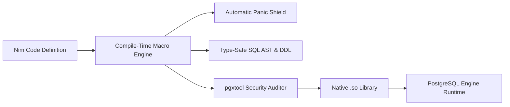

<div align="center">

# 👑 Pgxcrown

### Build Native, Crash-Proof, High-Performance PostgreSQL Extensions in Nim

[](https://nim-lang.org/)
[](https://www.postgresql.org/)
[](https://github.com/luisacosta828/pgxcrown/releases)
[](https://opensource.org/licenses/MIT)
[](#-binary-symbol-security-auditor)

<br/>


<br/>
<br/>

**Pgxcrown** is a modern framework and toolchain for building compiled, native [PostgreSQL](https://www.postgresql.org/) C extensions using [Nim](https://nim-lang.org/). It combines Nim's clean Python-like ergonomics, deterministic ARC/ORC memory management, and zero-overhead C transpilation with PostgreSQL's low-level engine architecture (`postgres.h`, `fmgr.h`, `executor/spi.h`).

</div>

---

## ⚡ Why Pgxcrown?

* 🚀 **Zero-VM C Performance**: Transpiles to native C shared libraries (`.so` / `.dll`) called directly by PostgreSQL with **0 runtime overhead**.
* 🛡️ **Automatic Panic Shield (`0 SIGABRTs`)**: Compiles automatic exception boundaries into every UDF—intercepting panics, overflows, and defects and safely aborting transactions without crashing the PostgreSQL server.
* 👑 **Type-Safe SQL Query Builder**: Write complex SQL queries with compile-time AST verification, zero-string table proxies (`u.name`), CTEs, window functions, and UPSERT.
* 📦 **Compile-Time Schema Introspection**: Generate production-ready PostgreSQL DDL and insert entities directly from pure Nim `object` types (`createTableFrom`, `insertFrom`).
* ⚡ **Hardened SPI Execution**: Execute in-database queries via PostgreSQL's Server Programming Interface with zero network socket latency, scalar fetchers, and functional stream reducers (`any`, `all`, `firstOption`).
* 🔒 **Binary Security Sandbox (`pgxtool`)**: Automatically audits compiled binaries with ELF symbol inspection (`auditBinarySymbols`) to block forbidden OS system calls (`execve`, `system`, `fork`).
* 📊 **Rich Type System**: Bidirectional zero-copy mapping for `seq[T] <-> array[]`, `Option[T] <-> NULL`, `enum <-> ENUM`, `tuple <-> record`, and `SETOF` Table Functions.

---

## 🚀 30-Second Quickstart

### 1. Install via Nimble
```bash
nimble install pgxcrown
```

### 2. Scaffold a New Extension
```bash
pgxtool init
pgxtool create-project my_extension
```

### 3. Write Your Nim Logic (`src/main.nim`)
```nim
import pgxcrown

# Exported functions are automatically bound to PostgreSQL C calling convention
proc add_numbers*(a: int32, b: int32): int32 =
  return a + b

proc greet*(name: string = "World"): string =
  return "Hello from Nim, " & name & "!"
```

### 4. Build & Install
```bash
# Compiles binary, audits symbols, and generates .control and .sql files
pgxtool build-extension my_extension

# Install into PostgreSQL's pkglibdir and extension directories
sudo /path/to/my_extension/src/install.sh
```

### 5. Run in PostgreSQL (`psql`)
```sql
CREATE EXTENSION my_extension;

SELECT add_numbers(10, 32);  -- Returns: 42
SELECT greet('PostgreSQL');   -- Returns: "Hello from Nim, PostgreSQL!"
```

---

## 👑 Core Capabilities Showcase



---

### 1. 🏗️ Type-Safe Query Builder AST (`v0.16.0`)

Write fluent, type-safe SQL with zero-string table proxies, compile-time AST validation, and **complete SQL injection immunity**:

```nim
import pgxcrown

proc get_engineering_leaders*(minSalary: int = 80000): string =
  let e = table("employees", "e")
  let d = table("departments", "d")

  # 1. Common Table Expression (CTE)
  let deptStats = Select(e.dept_id, avg(e.salary) as "avg_sal")
    .From(e)
    .GroupBy(e.dept_id)

  # 2. Main Query with CTE, Joins, Window Functions, and CASE WHEN
  let q = WithCte("dept_stats", deptStats)
    .Select(
      e.id as "emp_id",
      e.name as "emp_name",
      d.name as "dept_name",
      caseWhen(e.salary >= 100000).then("Senior Tier").elseEnd("Associate Tier") as "tier",
      rowNumber().over(partitionBy = e.dept_id, orderBy = e.salary.desc) as "dept_rank"
    )
    .From(e)
    .InnerJoin(d).On(e.dept_id == d.id)
    .Where(e.status == "active" and e.salary >= minSalary)
    .OrderBy(e.salary.desc.nullsLast)
    .Limit(25)

  return $q
```

---

### 2. 📦 Compile-Time Schema Introspection (`createTableFrom`)

Define pure Nim `object` models and generate full PostgreSQL DDL automatically—or execute them live inside the database:

```nim
import pgxcrown, std/options

type
  UserRecord = object
    id: int
    username: string
    reputation: float
    is_active: bool
    skills: seq[string]
    bio: Option[string] # Nullable field

# 1. Compile-Time Schema DDL Generation
let ddl = createTableFrom(UserRecord, tableName = "users", ifNotExists = true)
# Generates:
# CREATE TABLE IF NOT EXISTS "users" (
#   "id" INTEGER PRIMARY KEY,
#   "username" TEXT NOT NULL,
#   "reputation" DOUBLE PRECISION NOT NULL,
#   "is_active" BOOLEAN NOT NULL,
#   "skills" TEXT[] NOT NULL,
#   "bio" TEXT
# );

# 2. Execute live inside PostgreSQL via SPI
discard spiCreateTableFrom(UserRecord, tableName = "users")

# 3. Serialize and Insert Typed Entities via SPI
let sample = UserRecord(id: 42, username: "Ada", reputation: 99.8, is_active: true, skills: @["nim", "sql"], bio: some("Pioneer"))
discard spiInsertFrom(sample, tableName = "users")
```

---

### 3. ⚡ In-Database SPI Engine & Stream Reducers

Execute in-database queries via PostgreSQL's Server Programming Interface with zero socket latency:

```nim
# 1. Fetch scalar values directly
let activeCount = fetchScalar[int](
  Select(count("*")).From(table("users")).Where(table("users").is_active == true)
)

# 2. Query rows and apply functional collection reducers
let rows = fetchRawRows("SELECT id, username, reputation, is_active FROM users ORDER BY reputation DESC")

let hasTopTier = rows.any(proc(r: Table[string, string]): bool = parseFloat(r["reputation"]) >= 95.0)
let allActive  = rows.all(proc(r: Table[string, string]): bool = r["is_active"] == "t")
let topLeader  = rows.firstOption()
```

---

### 4. 🛡️ Automatic Panic Shield (`0 SIGABRTs`)

All exported functions are automatically wrapped in a compile-time panic shield. Unhandled defects (integer overflows, array out-of-bounds, nil dereferences) are intercepted and safely converted to PostgreSQL `ereport(ERROR)` transaction aborts without crashing the backend process:

```sql
-- Integer Overflow (2,147,483,647 + 1) -> Intercepted cleanly
SELECT proof_integer_overflow(2147483647, 1);
-- Result: ERROR: Extension Defect [OverflowDefect]: over- or underflow

-- Index Out-of-Bounds -> Intercepted cleanly
SELECT proof_index_out_of_bounds(5);
-- Result: ERROR: Extension Defect [IndexDefect]: index 5 not in 0 .. 2
```

---

### 5. 📊 Set Returning Functions (`RETURNS SETOF <type>`)

Returning a native Nim sequence (`seq[T]`) automatically generates `RETURNS SETOF <type>` in DDL and executes via PostgreSQL's `FuncCallContext` state machine:

```nim
proc generate_series_nim*(startVal: int32, endVal: int32): seq[int32] =
  result = @[]
  for i in startVal .. endVal:
    result.add(i)

proc list_fruits*(): seq[string] =
  return @["Apple", "Banana", "Cherry", "Dragonfruit"]
```

Generated SQL:
```sql
CREATE OR REPLACE FUNCTION generate_series_nim(int4, int4) RETURNS SETOF int4 AS
'myextension', 'pgx_generate_series_nim' LANGUAGE c STRICT;

CREATE OR REPLACE FUNCTION list_fruits() RETURNS SETOF text AS
'myextension', 'pgx_list_fruits' LANGUAGE c STRICT;
```

---

### 6. 🔢 Dynamic & Composite Array Mapping

Bidirectional zero-copy mapping between Nim sequences and PostgreSQL dynamic arrays:

```nim
# Primitive Dynamic Array (seq[int32] <-> int4[])
proc double_int_array*(numbers: seq[int32]): seq[int32] =
  result = newSeq[int32](numbers.len)
  for i in 0 ..< numbers.len:
    result[i] = numbers[i] * 2

# Composite Record Array (seq[Person] <-> record[])
type Person* = object
  age*: int32
  name*: string

proc count_adults*(people: seq[Person]): int32 =
  var count: int32 = 0
  for p in people:
    if p.age >= 18: count.inc
  return count
```

---

### 7. 💡 Default Arguments & `Option[T]` NULL Defense

```nim
import pgxcrown, std/options

proc greet*(name: string = "World", count: int = 1): string =
  "Hello " & name & " x" & $count

proc add_opt*(a: int, b: Option[int]): Option[int] =
  if b.isNone: none(int) else: some(a + b.get)
```

Generated SQL:
```sql
CREATE OR REPLACE FUNCTION greet(Text DEFAULT 'World', int4 DEFAULT 1) RETURNS Text AS
'myextension', 'pgx_greet' LANGUAGE c;

CREATE OR REPLACE FUNCTION add_opt(int4, int4 DEFAULT NULL) RETURNS int4 AS
'myextension', 'pgx_add_opt' LANGUAGE c;
```

---

### 8. 🔌 Raw Engine FFI & Deep C Extensibility

Directly bind **hundreds of low-level PostgreSQL engine C APIs** (`parser.h`, `executor.h`, `builtins.h`) using Nim's native `{.importc.}`:

```nim
{.push header: "parser/parser.h".}
proc raw_parser(str: cstring, mode: cint): pointer {.importc: "raw_parser".}
{.pop.}

proc parse_sql_query*(sqlText: string): string =
  let tree = raw_parser(cstring(sqlText), 0)
  return "Parsed AST pointer: " & repr(tree)
```

---

## 💻 `pgxtool` CLI Reference

The official CLI tool for scaffolding, building, auditing, and testing extensions:

| Command | Usage | Description |
| :--- | :--- | :--- |
| **`init`** | `pgxtool init` | Initializes local `pgxtool` working directory and configuration. |
| **`create-project`** | `pgxtool create-project <name>` | Scaffolds a new extension project directory and `main.nim`. |
| **`build-extension`** | `pgxtool build-extension <name>` | Compiles Nim to `.so`, audits security symbols, and generates `.control` and `.sql`. |
| **`install`** | `pgxtool install <name>` | Generates the privileged `install.sh` installation script. |
| **`create-type`** | `pgxtool create-type <name> --base-type <type>` | Generates a custom datatype template for domain mapping. |
| **`create-hook`** | `pgxtool create-hook <hook_name>` | Scaffolds a Postgres engine hook extension (`emit_log`, `post_parse_analyze`). |
| **`path-finders`** | `pgxtool path-finders` | Resolves PostgreSQL paths (`pg_config`, `libdir`, `includedir`, `sharedir`, `extension`). |
| **`test`** | `pgxtool test <name>` | Spins up a Docker container with PostgreSQL to mount and test the extension. |

---

## 📊 Summary of Capabilities by Version

| Version | Milestone Capabilities |
| :--- | :--- |
| **v0.16.0** | **Type-Safe Query Builder AST, Table Proxies, Compile-Time Schema Introspection (`createTableFrom`), Hardened SPI Engine, Stream Reducers (`any`, `all`, `firstOption`), and UPSERT (`ON CONFLICT`).** |
| **v0.15.0** | **Set Returning Functions (`RETURNS SETOF <type>`), Table Functions, and `FuncCallContext` state machine.** |
| **v0.14.0** | **Non-STRICT Null-Datum Defense (`isArgNull`), `CALLED ON NULL INPUT`, and safe zero-value fallbacks.** |
| **v0.13.2** | **PostgreSQL Dynamic Array Mapping (`seq[T] <-> int4[]/text[]/bool[]`) and Composite Record Arrays (`seq[Object] <-> record[]`).** |
| **v0.13.1** | **Dynamic ELF Binary Symbol Security Auditor (`auditBinarySymbols`) and Raw C Engine FFI (`isImportc`).** |
| **v0.13.0** | **Default Parameter SQL DDL (`DEFAULT`), `Option[T]` NULL safety, and `none(T) <-> NULL` return mappings.** |
| **v0.12.0** | **Zero-Overhead Automatic Panic Shield (`try...except Defect`) converting panics to safe `ereport(ERROR)` aborts (`0 SIGABRTs`).** |

---

## 🛠️ Prerequisites

* **PostgreSQL** $\ge 12$ (with development packages `postgresql-server-dev-all` or `pg_config`)
* **Nim Compiler** $\ge 2.0.0$
* **GCC / Clang**

---

## 🤝 Contributing

Contributions are welcome! Please feel free to submit a Pull Request or open an Issue on GitHub to discuss proposed features, extensions, or bugfixes.

---

## 📜 License

[MIT License](LICENSE) © 2026 Luis Acosta
