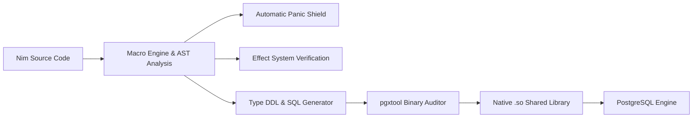

<div align="center">

# Pgxcrown

### High-Performance, Memory-Safe Native PostgreSQL Extension Framework for Nim

[](https://nim-lang.org/)
[](https://www.postgresql.org/)
[](https://github.com/luisacosta828/pgxcrown/releases)
[](https://opensource.org/licenses/MIT)
[](#3-sql-volatility-pragmas--compile-time-safety)

<br/>


<br/>

**Pgxcrown** is a modern framework and toolchain for building compiled, native [PostgreSQL](https://www.postgresql.org/) C extensions using [Nim](https://nim-lang.org/). It combines Nim's expressive syntax, deterministic ARC/ORC memory management, and zero-overhead C code generation with PostgreSQL's low-level engine internals (`postgres.h`, `fmgr.h`, `executor/spi.h`).

</div>

---

## Key Highlights

- **Zero-VM Native Performance**: Transpiles to native C shared libraries (`.so` / `.dll`) called directly by PostgreSQL with zero runtime overhead.
- **Universal `type object` Support**: Pure Nim `object` types automatically generate `CREATE TYPE "Name" AS (...)` DDL with bidirectional binary marshaling (`tupleHeaderToObject`, `objectToDatum`).
- **Native Binary JSONB**: Direct engine-level representation with `JsonNode` mapped via PostgreSQL builtins (`jsonb_in` / `jsonb_out`).
- **SQL Volatility & Parallelism**: Pragmas for `{.immutable.}`, `{.stable.}`, `{.volatile.}`, and `{.parallelSafe.}` with compile-time mathematical enforcement and automatic SQL DDL generation.
- **Type-Safe SQL Query Builder**: Fluent SQL AST with table proxies (`u.name`), CTEs, Joins, Window Functions, Case When, and UPSERT (`onConflictDoUpdate`).
- **Hardened SPI Execution**: Execute in-database queries via PostgreSQL's Server Programming Interface with zero socket latency, object mapping (`fetch[T]`), and stream reducers.
- **Automatic Panic Shield (`0 SIGABRTs`)**: Compiles automatic exception boundaries into every UDF—intercepting panics, overflows, and defects to safely abort transactions without crashing the backend process.

---

## 30-Second Quickstart

### 1. Install via Nimble
```bash
nimble install pgxcrown
```

### 2. Scaffold a New Extension
```bash
pgxtool init
pgxtool create-project my_extension
```

### 3. Write Your Nim Logic (`src/main.nim`)
```nim
import pgxcrown
import std/[options, json]

type
  User* = object
    id*: int32
    username*: string
    score*: float64
    active*: bool
    profile*: JsonNode

# Pure calculation: IMMUTABLE & PARALLEL SAFE
proc make_user*(id: int32, name: string, score: float64): User {.immutable, parallelSafe.} =
  return User(
    id: id,
    username: name,
    score: score,
    active: true,
    profile: %*{"tier": "gold", "verified": true}
  )

# In-database query: STABLE
proc get_top_users*(minScore: float64): seq[User] {.stable.} =
  let u = table("users", "u")
  let q = Select(u.id, u.username, u.score, u.active, u.profile)
    .From(u)
    .Where(u.active == true and u.score >= minScore)
    .OrderBy(u.score.desc)
    .Limit(50)
  return q.fetch(User)
```

### 4. Build & Install
```bash
# Compiles binary, audits symbols, and generates .control and .sql files
pgxtool build-extension my_extension

# Install into PostgreSQL system directories
sudo ./my_extension/src/install.sh
```

### 5. Run in PostgreSQL (`psql`)
```sql
CREATE EXTENSION my_extension;

-- 1. Call function returning a named composite type
SELECT * FROM make_user(1, 'Luis', 98.5);

-- 2. Query table functions with SETOF streaming
SELECT * FROM get_top_users(90.0);
```

---

## Core Capabilities



---

### 1. Universal `type object` & Named Composite Types

Define pure Nim `object` types in your code, and Pgxcrown automatically generates the matching `CREATE TYPE "Name" AS (...)` DDL at the top of your extension SQL file.

```nim
import pgxcrown
import std/[options, json]

type
  Person* = object
    id*: int32
    name*: string
    age*: int16
    score*: float64
    active*: bool
    metadata*: JsonNode

# Receives a composite type, modifies it, and returns it
proc bump_score*(p: Person, bonus: float64): Person {.immutable, parallelSafe.} =
  result = p
  result.score = p.score + bonus
  result.metadata = p.metadata.copy()
  result.metadata["bumped"] = %true

# Returns Option[Person] (translates to Person or SQL NULL)
proc find_person*(id: int32): Option[Person] {.stable.} =
  if id == 1:
    return some(Person(id: 1, name: "Alice", age: 30'i16, score: 95.5, active: true, metadata: %*{"role": "admin"}))
  return none(Person)
```

**Auto-Generated SQL DDL:**
```sql
CREATE TYPE "Person" AS (
  "id" int4,
  "name" Text,
  "age" int2,
  "score" float8,
  "active" boolean,
  "metadata" jsonb
);

CREATE OR REPLACE FUNCTION bump_score("Person", float8) returns "Person" as
'my_extension', 'pgx_bump_score'
language c IMMUTABLE PARALLEL SAFE STRICT;

CREATE OR REPLACE FUNCTION find_person(int4) returns "Person" as
'my_extension', 'pgx_find_person'
language c STABLE;
```

---

### 2. Native Binary JSON & JSONB Support

Pgxcrown connects Nim's `JsonNode` directly to PostgreSQL's internal binary `jsonb` engine format using `jsonb_in` and `jsonb_out`:

```nim
import pgxcrown, std/json

proc process_config*(cfg: JsonNode): JsonNode {.immutable.} =
  result = cfg.copy()
  result["processed"] = %true
  result["timestamp"] = %1700000000

proc default_settings*(): JsonNode {.immutable.} =
  return %*{"theme": "dark", "notifications": true, "max_connections": 100}
```

```sql
-- Pass JSONB literals directly into UDFs:
SELECT process_config('{"theme": "dark", "retries": 3}'::jsonb);
```

---

### 3. SQL Volatility Pragmas & Compile-Time Safety

Pgxcrown allows you to declare function volatility directly in Nim code. The compiler validates database operations at compile time and automatically generates the matching PostgreSQL function options:

| Pragma | Compile-Time Verification | PostgreSQL DDL | Description |
| :--- | :--- | :--- | :--- |
| **`{.immutable.}`** | Pure function, no DB reads/writes, no global state | `IMMUTABLE` | Result depends only on arguments. Eligible for functional indexes. |
| **`{.stable.}`** | Read-only DB queries allowed (`fetch`), no table writes | `STABLE` | Result is constant within a single table scan/transaction. |
| **`{.volatile.}`** | Read and write operations allowed (`insert`, DDL) | `VOLATILE` | Default mode. Function can modify database state. |
| **`{.parallelSafe.}`** | Concurrency-safe execution | `PARALLEL SAFE` | Eligible for PostgreSQL parallel query worker execution. |

#### Compile-Time Effect Safety

If you attempt to write to the database inside a `{.stable.}` or `{.immutable.}` function:
```nim
proc bad_stable_function*(): bool {.stable.} =
  discard spiInsertFrom(User(id: 1), "users") # Compile-time error!
```
The compiler prevents the build before deploying to PostgreSQL:
```text
Error: spiInsertFrom(User(), "users") has an illegal effect: DbWriteEffect
```

---

### 4. Type-Safe SQL Query Builder & SPI Engine

Write fluent, type-safe SQL queries and execute them in-database via SPI without network latency:

```nim
import pgxcrown

proc get_department_leaders*(minSalary: int = 80000): string =
  let e = table("employees", "e")
  let d = table("departments", "d")

  # CTE definition
  let deptStats = Select(e.dept_id, avg(e.salary) as "avg_sal")
    .From(e)
    .GroupBy(e.dept_id)

  # Main Query
  let q = WithCte("dept_stats", deptStats)
    .Select(
      e.id as "emp_id",
      e.name as "emp_name",
      d.name as "dept_name",
      caseWhen(e.salary >= 100000).then("Senior").elseEnd("Associate") as "tier",
      rowNumber().over(partitionBy = e.dept_id, orderBy = e.salary.desc) as "dept_rank"
    )
    .From(e)
    .InnerJoin(d).On(e.dept_id == d.id)
    .Where(e.status == "active" and e.salary >= minSalary)
    .OrderBy(e.salary.desc.nullsLast)
    .Limit(25)

  return $q
```

#### In-Database SPI Operations
```nim
# 1. Automatic table creation from Nim types
discard spiCreateTableFrom[User]("users", ifNotExists = true, primaryKey = "id")

# 2. Direct entity insertion
discard spiInsertFrom(User(id: 1, username: "luis_dev", score: 98.5), "users")

# 3. Typed entity fetching (.fetch[T] / .fetchOne[T])
let users = Select(u.id, u.username, u.score).From(u).fetch(User)
let singleUser = Select(u.id, u.username).From(u).Where(u.id == 1).fetchOne(User)
```

---

### 5. Automatic Panic Shield (`0 SIGABRTs`)

All exported functions are automatically enclosed in a panic-catching barrier. Unhandled defects (integer overflows, array out-of-bounds, nil dereferences) are caught cleanly and reported via PostgreSQL's `ereport(ERROR)` without terminating the backend worker process:

```sql
-- Integer Overflow -> Caught cleanly
SELECT proof_integer_overflow(2147483647, 1);
-- Result: ERROR: Extension Defect [OverflowDefect]: over- or underflow

-- Index Out-of-Bounds -> Caught cleanly
SELECT proof_index_out_of_bounds(5);
-- Result: ERROR: Extension Defect [IndexDefect]: index 5 not in 0 .. 2
```

---

## `pgxtool` CLI Reference

`pgxtool` manages the extension lifecycle from scaffolding to compilation and testing:

| Command | Usage | Description |
| :--- | :--- | :--- |
| **`init`** | `pgxtool init` | Initializes local workspace configuration. |
| **`create-project`** | `pgxtool create-project <name>` | Scaffolds a new extension project directory and `main.nim`. |
| **`build-extension`** | `pgxtool build-extension <name>` | Compiles Nim to `.so`, audits security symbols, and generates `.control` and `.sql`. |
| **`install`** | `pgxtool install <name>` | Generates the privileged `install.sh` installation script. |
| **`create-type`** | `pgxtool create-type <name> --base-type <type>` | Generates a custom datatype template. |
| **`create-hook`** | `pgxtool create-hook <hook_name>` | Scaffolds a Postgres kernel hook (`emit_log`, `post_parse_analyze`). |
| **`path-finders`** | `pgxtool path-finders` | Inspects resolved PostgreSQL system paths (`pg_config`, `libdir`, `includedir`). |
| **`test`** | `pgxtool test <name>` | Spawns a Docker container with PostgreSQL to build and test the extension. |

---

## Supported Type Mappings

| Nim Type | PostgreSQL Type | Generated DDL |
| :--- | :--- | :--- |
| `int32` / `int` | `INTEGER` | `int4` |
| `int64` | `BIGINT` | `int8` |
| `int16` | `SMALLINT` | `int2` |
| `float64` / `float` | `DOUBLE PRECISION` | `float8` |
| `float32` | `REAL` | `float4` |
| `string` / `cstring` | `TEXT` | `Text` / `cstring` |
| `bool` | `BOOLEAN` | `boolean` |
| `JsonNode` | `JSONB` | `jsonb` |
| `Option[T]` | Nullable type | `type DEFAULT NULL` |
| `seq[T]` (Argument) | `T[]` | `int4[]`, `text[]`, `jsonb[]` |
| `seq[T]` (Return) | `SETOF T` | `RETURNS SETOF <type>` |
| `type T = object` | Named Composite Type | `CREATE TYPE "T" AS (...)` |
| `type T = enum` | PostgreSQL ENUM | `CREATE TYPE "T" AS ENUM (...)` |

---

## Prerequisites

- **PostgreSQL** $\ge 12$ (with development packages `postgresql-server-dev-all` or `pg_config`)
- **Nim Compiler** $\ge 2.0.0$
- **GCC / Clang**

---

## License

[MIT License](LICENSE) © 2026 Luis Acosta
